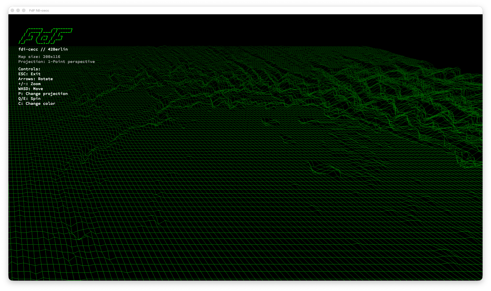
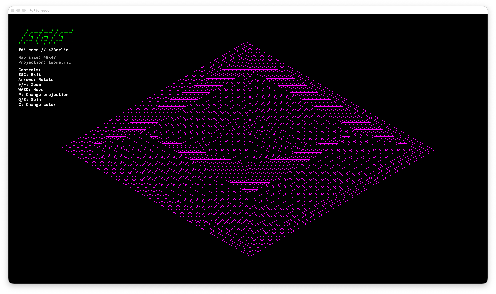
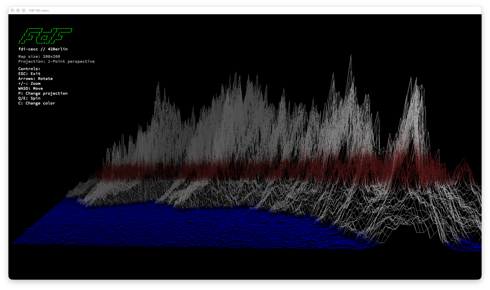
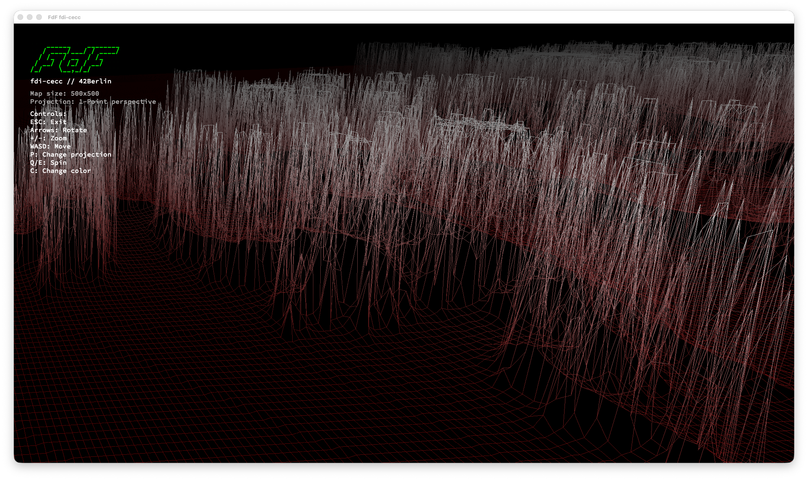

# Fdf

[](https://github.com/topics/c)

## Description

Fdf (short for *fil de fer*, French for "wireframe model") is a 3D wireframe landscape renderer written in C. It reads terrain data from `.fdf` map files — grids of height values — and renders them as interactive 3D wireframe models using the MiniLibX graphics library. The project supports multiple projection modes, real-time camera controls, color interpolation based on terrain depth, and performance optimizations including screen-space point caching and precomputed transforms for smooth interaction with large maps.

## Technologies & Concepts

- 3D-to-2D projection mathematics (isometric, orthographic, perspective)
- Matrix transformations for rotation and scaling
- DDA (Digital Differential Analyzer) line drawing algorithm
- Event-driven graphics programming with MiniLibX
- Image buffer manipulation and pixel-level rendering
- Color interpolation and depth-based shading
- File parsing for structured terrain data
- Memory management for 2D grid data structures
- Performance optimization through caching and precomputation

## Installation

### Prerequisites

- **Linux:** X11 development libraries
- **macOS:** No additional dependencies (OpenGL and AppKit are built-in)

```bash
# Linux dependencies
sudo apt-get install libx11-dev libxext-dev
```

```bash
git clone https://github.com/fabbbiodc/fdf.git
cd fdf
```

The Makefile automatically detects your operating system and selects the correct MiniLibX version and link flags:

- **macOS:** Uses `minilibx_opengl/` with `-framework OpenGL -framework AppKit`
- **Linux:** Uses `minilibx_linux/` with `-lX11 -lXext`

No manual configuration needed — just run `make`.

## Usage

```bash
./fdf maps/<map_file>.fdf
```

**Examples:**
```bash
./fdf maps/42.fdf          # Classic 42 logo terrain
./fdf maps/mars.fdf        # Mars surface topography
./fdf maps/pyramide.fdf    # Pyramid shape
./fdf maps/julia.fdf       # Julia fractal terrain (large map)
```

### Controls

| Key | Action |
|-----|--------|
| `ESC` | Quit |
| `+` / `-` | Zoom in / out |
| `←` / `→` | Rotate around Y axis |
| `↑` / `↓` | Rotate around X axis |
| `Q` / `E` | Spin (Z axis rotation) |
| `A` / `D` | Move left / right |
| `W` / `S` | Move up / down |
| `P` | Cycle projection mode |
| `C` | Toggle color scheme |
| `O` / `L` | Adjust perspective distance |

### Projection Modes (press `P` to cycle)

1. **Isometric** — Default 30° isometric projection
2. **Orthographic** — Top-down view without perspective
3. **One-point perspective** — Single vanishing point
4. **Two-point perspective** — Dual vanishing points for dynamic view

## Compilation

| Command | Description |
|---------|-------------|
| `make` | Compile Fdf |
| `make clean` | Remove object files |
| `make fclean` | Remove all build artifacts and libraries |
| `make re` | Full rebuild |

## How It Works

Fdf transforms 3D terrain data into a 2D wireframe rendering through a multi-stage pipeline:

1. **Parsing** — Reads `.fdf` files where each number represents a point's altitude. Grid position determines X/Y coordinates, value determines Z (height). Optional hex colors (`0xRRGGBB`) can be embedded per point.
2. **Camera Setup** — Calculates map bounds and fits the view to the window, centering the terrain.
3. **Transformation** — Each point undergoes rotation (X, Y, Z axes), scaling, and centering transformations using 3×3 rotation matrices. The rotation matrix is computed once per frame and reused for all points.
4. **Projection** — Transformed 3D points are projected to 2D using the selected projection mode (isometric, orthographic, one-point, or two-point perspective). The perspective rotation matrix is precomputed as a constant.
5. **Screen-Space Caching** — Transformed points are stored in a 2D cache (`fdf->screen[y][x]`) to avoid redundant transformations. Depth range is computed inline during this pass.
6. **Rendering** — The cached screen points are used to draw lines between adjacent points (horizontal and vertical neighbors) with color interpolation between endpoints. An inlined DDA algorithm computes step values once per line for efficient pixel-by-pixel rendering.
7. **Panel Overlay** — A semi-transparent info panel displays map dimensions, current projection, color scheme, and control hints.

## Key Features

- **Four Projection Modes** — Isometric, orthographic, one-point and two-point perspective with real-time switching
- **Interactive Camera** — Full rotation (X/Y/Z axes), translation (pan), and zoom controls
- **DDA Line Drawing** — Smooth line rendering using the Digital Differential Analyzer algorithm
- **Color Interpolation** — Gradient colors between connected points with depth-based fading
- **Multiple Color Schemes** — Toggle between different terrain coloring modes
- **Perspective Distance Control** — Adjust projection distance to fine-tune perspective distortion
- **Info Panel** — Real-time display of map info, projection mode, and controls
- **Multiple Map Files** — Ships with 20+ terrain maps including Mars topography, fractals, and geometric shapes
- **Cross-Platform** — Native support for macOS (OpenGL) and Linux (X11) with automatic OS detection
- **Performance Optimized** — Screen-space point cache eliminates redundant transforms (2-4x per point → 1x), precomputed rotation matrix (once per frame vs per point), and inlined DDA without per-pixel recalculation. 10-20x faster on large maps in perspective mode.

## Map File Format

`.fdf` files contain a grid of integers where each value represents altitude:

```
0 0 0 0 0
0 10 10 10 0
0 10 20 10 0
0 10 10 10 0
0 0 0 0 0
```

Colors can be specified per point using hex notation:

```
0,0x000000 10,0x00FF00 20,0xFF0000
```

### Creating Your Own Maps

You can create custom `.fdf` maps by writing a grid of integers in any text editor. Each row represents a line of the terrain, and each number represents the altitude at that point. Experiment with different shapes, patterns, and color combinations to create unique landscapes!

```bash
# Create a simple pyramid
cat > maps/my_map.fdf << EOF
0 0 0 0 0
0 5 5 5 0
0 5 10 5 0
0 5 5 5 0
0 0 0 0 0
EOF

./fdf maps/my_map.fdf
```

Try generating maps programmatically with Python, shell scripts, or any language — the format is just space-separated numbers. This is a great way to experiment with procedural terrain generation and test edge cases.

## Project Structure

```
fdf/
├── inc/
│   ├── fdf.h              # Main header with function prototypes
│   ├── keys.h             # Cross-platform keycode definitions (macOS + Linux)
│   ├── structs.h          # Data structures (t_pnt, t_map, t_cam, t_mlx, etc.)
│   └── variables.h        # Constants and configuration
├── src/
│   ├── fdf.c              # Entry point, hooks, main loop
│   ├── parse.c            # Map file parsing, color extraction
│   ├── map.c              # Map allocation, size detection, cleanup
│   ├── render.c           # Point transformation with precomputed rotation matrix
│   ├── projections.c      # Isometric, orthographic, 1-point, 2-point projections
│   ├── rotations.c        # 3×3 rotation matrices (X, Y, Z axes), precomputed perspective rotation
│   ├── draw.c             # Two-pass rendering, inlined DDA, pixel placement, color handling
│   ├── screen.c           # Screen-space point cache allocation and deallocation
│   ├── dda.c              # DDA line drawing algorithm (legacy, replaced by inlined version)
│   ├── controls.c         # Keyboard input handling, camera controls
│   ├── cam.c              # Camera fitting, bounds calculation
│   ├── color.c            # Color interpolation, depth fading, scheme toggle
│   ├── panel.c            # Info panel rendering with alpha blending
│   ├── placement.c        # Map centering, limit updates
│   ├── init.c             # MLX initialization, image setup
│   └── free.c             # Memory cleanup, MLX teardown
├── maps/                  # Sample terrain files (20+ maps)
├── libft/                 # Linked Libft submodule
├── minilibx_linux/        # MiniLibX for Linux (X11)
├── minilibx_opengl/       # MiniLibX for macOS (OpenGL)
├── Makefile               # Build automation with OS auto-detection
└── README.md
```

## Performance

Large maps (1000×1000+ points) can be computationally expensive to render. The following optimizations ensure smooth interaction:

| Optimization | Before | After | Impact |
|---|---|---|---|
| **Rotation matrix** | Computed per point (N×N times/frame) | Computed once per frame | 5-10x faster transforms |
| **Point transforms** | Each point transformed 2-4x (once per neighbor) | Transformed once, cached | 2-4x fewer transforms |
| **Depth computation** | Separate full-map pass | Computed inline during transform | Eliminates 1 full pass |
| **DDA line drawing** | Recalculated deltas/steps per pixel | Computed once, incremented | ~2x faster lines |
| **Combined (large map, perspective)** | — | — | **10-20x faster per frame** |

The screen-space cache (`fdf->screen[y][x]`) stores transformed 2D coordinates for every map point, trading ~38 MB of memory for a 1000×1000 map to avoid redundant computations during rendering and interaction.

## Visuals








## Tech Stack

- **Language:** C
- **Graphics:** MiniLibX — OpenGL (macOS) / X11 (Linux) with automatic OS detection
- **Math:** Standard math library (`-lm`) — rotation matrices, trigonometry
- **Line Drawing:** DDA (Digital Differential Analyzer) algorithm
- **Libraries:** Custom Libft submodule for utility functions

## Resources

- [MiniLibX Documentation](https://harm-smits.github.io/42docs/libs/minilibx) — School's graphics library reference
- [Isometric Projection](https://en.wikipedia.org/wiki/Isometric_projection) — Mathematical basis for isometric views
- [DDA Line Algorithm](https://en.wikipedia.org/wiki/Digital_differential_analyzer_(graphics_algorithm)) — Line drawing algorithm used for rendering
- [Perspective Projection](https://en.wikipedia.org/wiki/3D_projection) — One-point and two-point perspective mathematics
- [Rotation Matrix](https://en.wikipedia.org/wiki/Rotation_matrix) — 3D rotation transformations
